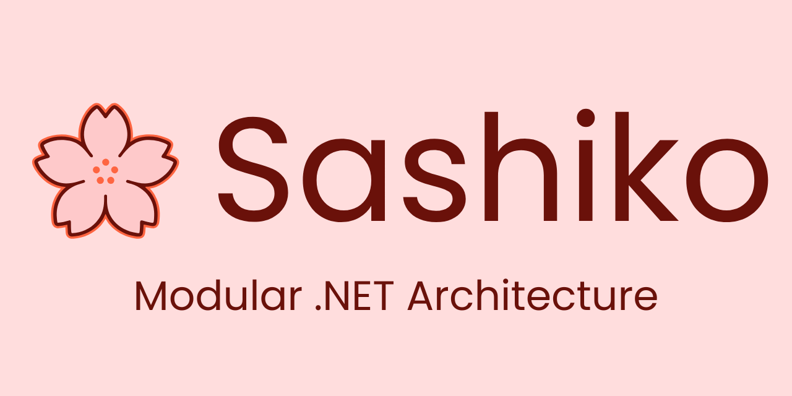

# 🌸 Sashiko

<p align="center">
  
</p>

**Sashiko** is an open-source ecosystem of modular .NET libraries built to make development faster, cleaner, and more enjoyable.

The project is inspired by the Japanese craft of sashiko stitching: small, precise patterns that become stronger and more useful when composed together.
Each Sashiko package is designed to stand on its own, while also fitting into a larger set of reusable tools for data-rich applications, simulations, and creative software projects.

---

## 🧵 Packages

| Package | Description | Status |
|---------|-------------|--------|
| **Sashiko.Core** | Shared utilities, conversions, probability helpers, JSON helpers, and foundational primitives | Released |
| **Sashiko.Registries** | JSON-backed registry loading helpers for embedded or declarative data | Released |
| **Sashiko.Validation** | Lightweight validation and schema inspection utilities | Released |
| **Sashiko.SystemMonitor** | Cross-platform hardware and operating-system snapshot utilities | Released |
| **Sashiko.Languages** | Embedded ISO 639 language registry with strongly typed lookup APIs | Released |
| **Sashiko.Names** | Embedded, culturally aware person name generator with curated language data | Released |
| **Sashiko.Maintenance** | Internal tooling for maintaining embedded package data | Internal |

---

## 📦 Installation

Install only the packages you need.

```bash
dotnet add package Sashiko.Names
dotnet add package Sashiko.Languages
dotnet add package Sashiko.Core
```

Each library is versioned and published independently so applications can adopt the ecosystem gradually.

---

## 🚀 Quick Examples

### Generate a Person Name

```csharp
using Sashiko.Names.Api;
using Sashiko.Names.Model.Enums;

var service = new NameService();
var name = service.Generate(Sex.Female, LanguageId.Fra);

Console.WriteLine(name.FullName);
```

### Lookup a Language

```csharp
using Sashiko.Languages.Api;

var service = new LanguageService();
var language = service.GetIso3("eng");

Console.WriteLine(language.Name); // English
```

---

## ✨ Project Principles

Sashiko packages should be:

- **Modular** — each package solves a clear problem and can be adopted alone
- **Lightweight** — runtime dependencies are kept intentional and minimal
- **Deterministic** — embedded data is validated and maintained through tests
- **Composable** — packages are designed to support larger systems over time
- **Well documented** — public packages include README and changelog files
- **Automation friendly** — repeatable maintenance and release workflows are preferred over manual steps

---

## 🗺️ Roadmap

The current focus is simple: keep the existing packages clean, documented, tested, and easy to release.

Future package families may include:

- **Sashiko.Geography** — countries, regions, cities, coordinates, and geopolitical data
- **Sashiko.People** — richer people generation, demographics, development, and life modeling
- **Sashiko.Sports** — reusable sports simulation primitives and domain models
- **Sashiko.Economics** — economic indicators, markets, organizations, and development systems
- **Sashiko.Worlds** — higher-level composition primitives for larger simulation systems

The long-term goal is to grow Sashiko one carefully designed package at a time, without letting the ecosystem become heavy, messy, or difficult to maintain.

---

## 📚 Documentation

Package-level documentation lives inside each package folder:

- [Sashiko.Core](./Sashiko.Core/README.md)
- [Sashiko.Languages](./Sashiko.Languages/README.md)
- [Sashiko.Names](./Sashiko.Names/README.md)
- [Sashiko.Registries](./Sashiko.Registries/README.md)
- [Sashiko.SystemMonitor](./Sashiko.SystemMonitor/README.md)
- [Sashiko.Validation](./Sashiko.Validation/README.md)
- [Sashiko.Maintenance](./Sashiko.Maintenance/README.md)

---

## 🎨 Branding

Official Sashiko branding assets live in [assets/sashiko-logo](./assets/sashiko-logo). The repository uses the GitHub logo at
[assets/sashiko-logo/github/sashiko-github-logo.png](./assets/sashiko-logo/github/sashiko-github-logo.png) and the NuGet package icon at
[assets/sashiko-logo/nuget/sashiko-logo-nuget.png](./assets/sashiko-logo/nuget/sashiko-logo-nuget.png).

The assets are provided to identify the official Sashiko project and packages. They are proprietary and are not covered by the
Apache 2.0 source-code license. See [assets/ASSETS-LICENSE.md](./assets/ASSETS-LICENSE.md) before reusing them outside this repository.

---

## 🤝 Contributing

Contributions are welcome. Please read [CONTRIBUTING.md](./CONTRIBUTING.md) before opening a pull request.

Good contributions include:

- bug fixes
- tests
- documentation improvements
- package metadata improvements
- new curated data sources
- carefully scoped new package proposals

---

## 📬 Contact

- **Email**: [sashiko@alex98luca.com](mailto:sashiko@alex98luca.com)
- **Author**: Alexandru Luca (alex98luca)
- **LinkedIn**: [Alexandru Luca](https://www.linkedin.com/in/alexandru-98-luca)

---

## ⚖️ License

The source code is licensed under the **Apache License 2.0**.  
See [LICENSE](./LICENSE) for the full license text.

Branding assets in the `/assets` directory are proprietary and are governed separately by
[assets/ASSETS-LICENSE.md](./assets/ASSETS-LICENSE.md).
